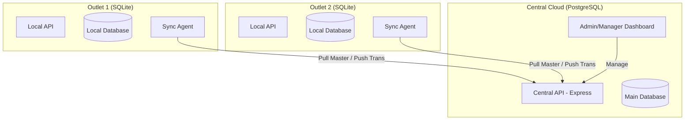
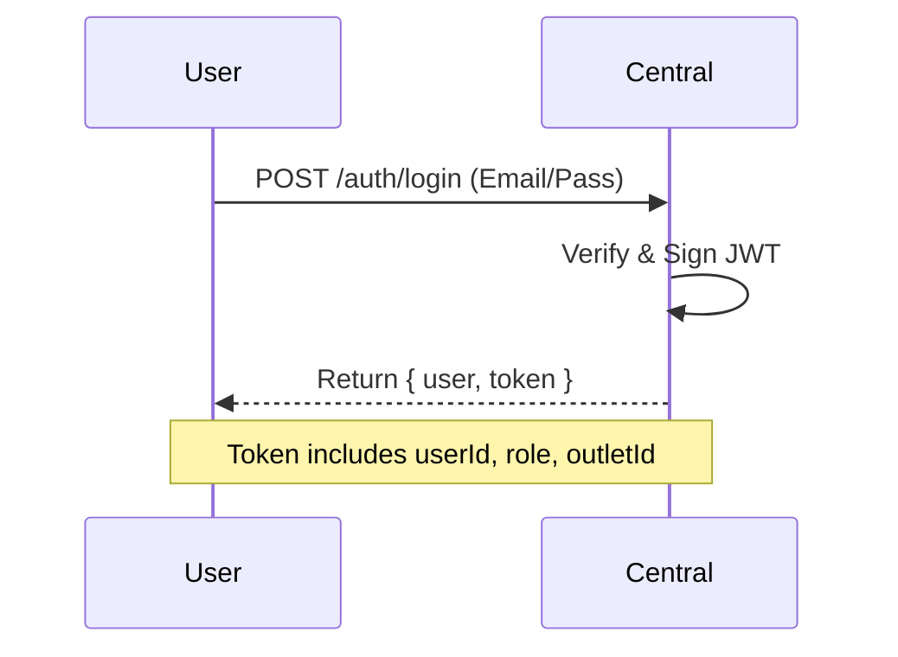
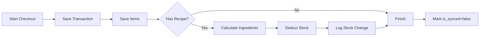

# Backend Workflow & Architecture Documentation

This document provides a technical overview of how the Kasir Backend system operates, focusing on the relationship between the Central Server and the Local Outlets.

---

## 1. System Architecture Overview

The system follows a **Hybrid Decentralized Architecture**. It uses a central authority for management and local instances for high-availability operations.

---

## 2. Authority Model (Source of Truth)

To prevent data conflicts, we use a **Manager-Centric Authority** model:

| Data Type | Primary Source | Flow Direction | Description |
|:--- |:--- |:--- |:--- |
| **Master Data** | Central (PostgreSQL) | Downstream (⬇️) | Products, Recipes, Roles, Users. |
| **Operational Data** | Local (SQLite) | Upstream (⬆️) | Transactions, Shifts, Stock Logs. |

---

## 3. Core Workflows

### A. Authentication & Authorization
Users login to the Central Server to obtain a JWT. This token contains the `outletId`, which is the primary key for data isolation.

### B. Synchronization Engine (The Bridge)
This is the heart of the system, ensuring outlets stay updated and Central stays informed.

#### 1. Pull Mechanism (Central ➡️ Local)
Occurs periodically to update local product lists, prices, and recipes.
- **Endpoint**: `GET /sync/pull?last_sync=TIMESTAMP`
- **Logic**: Upserts records into Local SQLite based on the `updated_at` field.

#### 2. Push Mechanism (Local ➡️ Central)
Uploads offline transactions to the manager dashboard.
- **Endpoint**: `POST /sync/push`
- **Workflow**:
    1. Local Agent finds records where `is_synced = false`.
    2. Sends bulk data to Central.
    3. Central saves data to PostgreSQL using `outletId` from the token.
    4. Local marks records as `is_synced = true`.

---

## 4. Operational Data Flow (Checkout)

When a cashier performs a sale, the following occurs **locally** and **atomically**:

1.  **Atomicity**: Uses SQLite transactions to ensure that if stock deduction fails, the sale isn't recorded.
2.  **Stock Calculation**: Automatically calculates raw material usage based on the `recipes` table.
3.  **Sync Trigger**: The record is flagged for the next `Push` cycle.

---

## 5. Security & Isolation

-   **Multi-Tenancy**: All tables in Central have an `outlet_id` column.
-   **Middleware**: The `authenticate` middleware extracts the `outletId` from the JWT.
-   **Query Scoping**: Every DB query in Central is scoped: `where(eq(table.outletId, req.user.outletId))`.
-   **Role-Based Access (RBAC)**:
    -   `Admin`: Global access.
    -   `Manager`: Access to reports and Master Data for their specific outlet.
    -   `Cashier`: Access to transaction endpoints.

---

## 6. Technology Stack Summary

-   **Language**: TypeScript (ESM)
-   **Framework**: Express.js
-   **ORM**: Drizzle ORM
-   **Databases**: PostgreSQL (Central), SQLite (Local)
-   **Validation**: Zod (Schema-based)
-   **Drivers**: `node-postgres` (PG), `better-sqlite3` (SQLite)
-   **Execution**: `tsx` (TypeScript Execution)
